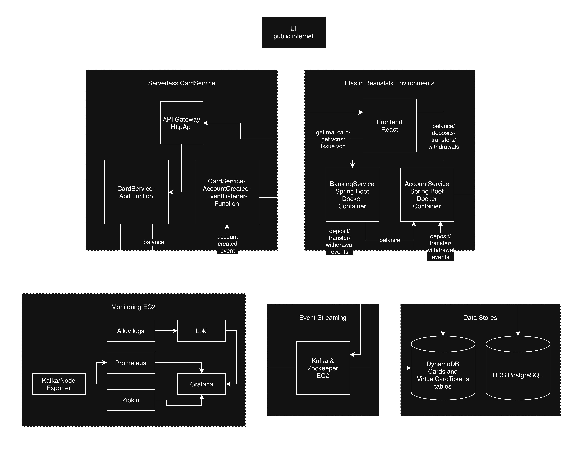

## Banking Portfolio Application

A full-stack, event-driven banking system built on AWS, demonstrating modern cloud-native architecture with serverless components, secure VPC design, and comprehensive observability.

### Architecture



### Overview

- **Frontend**: React single-page app on Elastic Beanstalk (Docker)
- **Banking & Account Services**: Spring Boot Java applications on EB Docker platform
- **Card Service**: Serverless AWS Lambda with Spring Cloud Function, HttpApi, and DynamoDB
- **Event Bus**: Private Kafka cluster on EC2
- **Observability**: Prometheus, Grafana, Loki, Alloy, Zipkin
- **Unit and Integration Testing**: JUnit, Mockito, Testcontainers, Vitest, MSW
- **Code Quality & Security**: SonarQube, OWasp

**Key Highlights**:
- Event-driven card creation via Kafka
- Load tested with k6 at 5000 virtual users (0% errors, p95 ~69 ms)
- Secure VPC with private endpoints
- Full observability across metrics, logs, and traces

### Tech Stack

- Frontend: React, Redux, Tailwind
- Backend: Spring Boot 3, Spring Cloud AWS, Spring Cloud Function
- Infrastructure: AWS Elastic Beanstalk (Docker), AWS Lambda, API Gateway HTTP API, DynamoDB, RDS PostgreSQL, Kafka on EC2
- CI/CD: GitHub Actions + AWS SAM + CloudFormation
- Observability: Prometheus, Grafana, Loki, Alloy, Zipkin, k6

### Setup Instructions

#### Prerequisites (Local Machine Installation)

Before running locally or deploying, install the following tools:

- **AWS CLI v2** – `aws configure` after installation
- **AWS SAM CLI** – Required for card-service local development and deployment
- **Docker & Docker Compose** – For running banking, account, and monitoring services
- **LocalStack** – For local DynamoDB emulation (`pip install localstack` or via Docker)
- **Maven** – For building Spring Boot services
- **Node.js + npm** – For frontend (React)
- **k6** – For load testing (`brew install k6` on macOS, or official installer)
- **Git** – Obviously

**Optional but recommended**:
- **Insomnia / curl** – For manual API testing

All tools are free and work on macOS, Linux, and Windows (WSL recommended for Windows).

#### AWS Deployment

The full AWS deployment is handled by **GitHub Actions** (`.github/workflows/ci-cd.yml`).

**Required GitHub Secrets** (add in repository Settings → Secrets and variables → Actions):

| Secret Name | Description |
|-------------|-------------|
| `AWS_ACCESS_KEY_ID` | AWS IAM user access key  |
| `AWS_SECRET_ACCESS_KEY` | AWS IAM user secret key  |
| `DOCKERHUB_USERNAME` | Docker Hub username  |
| `DOCKERHUB_TOKEN` | Docker Hub access token  |
| `YOUR_PUBLIC_IP`  | Your public IP (for temporary SSH to Kafka EC2) |

**Deployment Steps**:

1. Push code to the `main` branch (or the branch configured in `ci-cd.yml`).
2. GitHub Actions will automatically:
   - Build and test Docker images for banking-service, account-service, and frontend
   - Deploy the four CloudFormation stacks (`core`, `eb`, `card-lambda`, `monitoring`)
   - Run smoke tests

**After deployment**, you will see outputs in the GitHub Actions logs for:
- Frontend URL
- Card Service API URL
- Monitoring EC2 public IP (Grafana, Zipkin, etc.)

#### Local Development

##### 1. Start core banking services and monitoring stack

**Important note**: Start core banking services first to create the `banking-network` for monitoring stack.  
You can start core alone if you don't need monitoring.

```shell
# Option 1: Core only
docker-compose up -d  # root directory

# Option 2: Core + Monitoring (recommended for full observability)
docker-compose up -d
cd monitoring
docker-compose -f docker-compose.monitoring.yml up -d
```

This starts:
- frontend (port 80)
- banking-service (port 8080)
- account-service (port 8081)

Access:
- React UI: http://localhost
- Grafana: http://localhost:3000 (admin/admin)
- Zipkin: http://localhost:9411
- Prometheus: http://localhost:9090
- Loki: http://localhost:3100

##### 2. Start Card Service Locally (with LocalStack)

```shell
cd backend/card-service

# Start LocalStack for DynamoDB
localstack start -d

# Start SAM local API (uses LocalStack)
sam local start-api --debug
```

Card service will be available at http://localhost:3000 (or the port shown in SAM output).

##### 3. Load Testing (Local)

```bash
cd load-tests
k6 run load-test.js
```

##### 4. Teardown Local Environment

```bash
# Stop monitoring
docker-compose -f docker-compose.monitoring.yml down

# Stop core banking
docker-compose down

# Stop LocalStack
localstack stop
```

#### Observability Access (Local)

- Grafana: http://localhost:3000
- Zipkin: http://localhost:9411
- Loki: http://localhost:3100

Default credentials: admin / admin (change in production).


---

Built as a portfolio project to showcase modern AWS backend development, event-driven design, and production-grade observability.